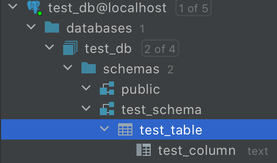

<h1>Test project to showcase what seems to be an ebean bug.</h1>
Ebean does not respect schema in connections to PostgresSQL. 
Tested on PostgreSQL 12. 
User: test_user. 
Database: test_db, owned by test_user. 
Schema: test_schema. 
There was one table: test_db.test_schema.test_table. 
 
Simple query fails with exception org.postgresql.util.PSQLException: ERROR: relation "test_table" does not exist. 
More details in code.
